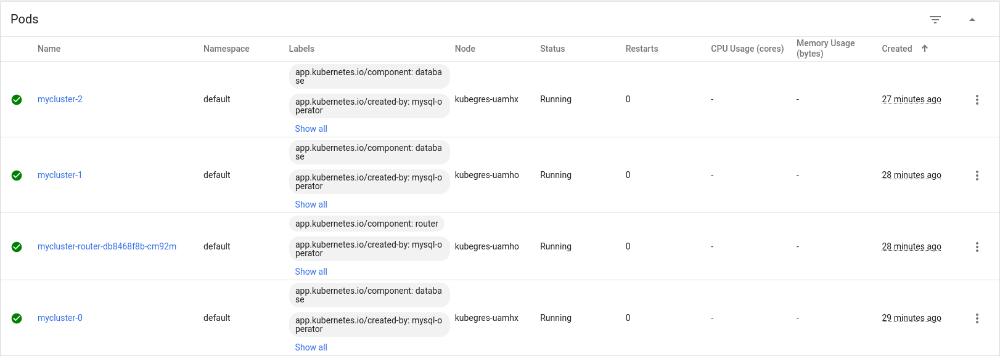

# do_k8s_postgresql
Repository for DigitalOceans Kubernetes challenge

At first I was going to install a PostgreSQL-database but I run in some issues with Persistent Volume Claims and decided to switch to MySQL cluster.

## Installing doctl

I'm new to DigitalOcean so I started with installing doctl.  

First I downloaded it with command:
```
wget https://github.com/digitalocean/doctl/releases/download/v1.66.0/doctl-1.66.0-linux-amd64.tar.gz
```

Next extracted downloaded file with command:  
```
tar xf ~/doctl-1.66.0-linux-amd64.tar.gz
```

And then move the extracted binary to path with command:  
```
sudo mv ~/doctl /usr/local/bin
```

Then I created an API-key with read/write-permissions and added the authentication to my doctl and switch to that context with commmands:  
```
doctl auth init --context personal
doctl auth switch --context personal
```

Then I verify that it's working with command `doctl account get` and I get my account info

## Managing Kubernetes cluster

First I created a new Kubernetes cluster with the GUI and then connected to it via doctl with command:  
```
doctl kubernetes cluster kubeconfig save 1f736b0f-8d77-409c-a92f-b210303c5cd6
```

Finally I swich kubectl context to the created cluster with command:  
```
kubectl config use-context do-fra1-k8s-challenge-kubegres
```

## Installing MySQL operator

MySQL Operator can be installed using kubectl with commands:  
```
kubectl apply -f https://raw.githubusercontent.com/mysql/mysql-operator/trunk/deploy/deploy-crds.yaml
kubectl apply -f https://raw.githubusercontent.com/mysql/mysql-operator/trunk/deploy/deploy-operator.yaml
```

We can verify with command `kubectl get deployment -n mysql-operator mysql-operator`.  

After we see that the operator is running we can continue to create a MySQL InnoDB cluster

## Creating MySQL InnoDB Cluster

InnoDB cluster need a secret containgin credentials for a MySQL root user and can be created with kubectl like this:  
```
kubectl create secret generic mypwds \
        --from-literal=rootUser=root \
        --from-literal=rootHost=% \
        --from-literal=rootPassword="your secret password, REPLACE ME"
```

After creating the secret a cluster can be created by command:  
```
kubectl apply -f https://raw.githubusercontent.com/mysql/mysql-operator/trunk/samples/sample-cluster.yaml
```

Progress of cluster creation can be followed with command `kubectl get innodbcluster --watch`.  

## Connecting to the cluster

For connecting a service is created inside the Kubernetes cluster. That can be seen with command `kubectl get service mycluster`. More information can be aqcuired with command `kubectl describe service mycluster`.  

Now that the service is running we need to forward ports to access the database. That can be done with command `kubectl describe service mycluster`. After that we can access the database with a second terminal and our previously set credentials with command `mysqlsh -h127.0.0.1 -P6446 -uroot -p`.


## Conclusion

As we can see from the DO Kubernetes dashboard, we have 3 running InnoDB-clusters for reduntant access for our database and Kubernetes creates new pods if something would happen to a cluster pod.  



